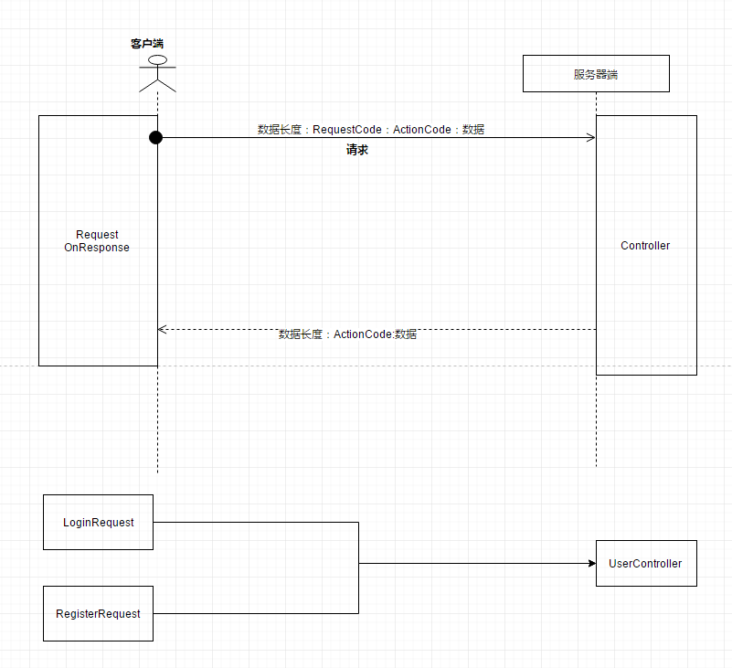
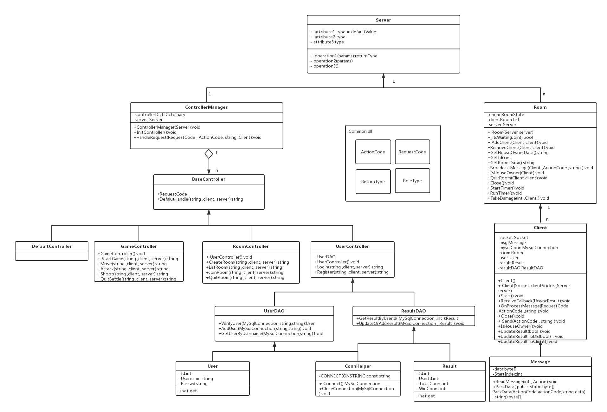

# Game Server of Deeper 本科大创游戏设计服务端实现


## 网络技术

### 通信基础
#### socket
- 服务器端：   
  - 申请一个socket  
  - 绑定到一个IP地址和一个端口上
  - 开启侦听，等待接收连接

- 客户端：
  - 申请一个socket
  - 连接服务器(指明IP地址和端口号)
  - 服务器端接收到连接请求后，加入一个新的socket(端口大于1024)与客户端建立连接并进行通信，原监听socket继续监听。
  - 注意：负责通信的Socket不能无限创建，创建的数量和操作系统有关。
  
#### 异步通信方式
- 服务器端：  
```
    01，开始异步接受传入的连接（socket）BeginAccept

    02，完成 连接传入后的Accept回调函数 AcceptCb

    03，Accept回调函数中开始异步接收该客户端socket发送的消息 BeginRecieve
    
    04， 完成接收消息的回调函数 RecieveCb
    
    05， RecieveCb 继续异步接收传入的消息
    
    06，Accept回调函数中继续异步接受传入的连接

```
- code
```
//服务器Server类
public void Start()
{
    serverSocket = new Socket(AddressFamily.InterNetwork, SocketType.Stream, ProtocolType.Tcp);
    serverSocket.Bind(ipEndPoint);
    serverSocket.Listen(0);
    serverSocket.BeginAccept(AcceptCallBack, null);
}

private void AcceptCallBack(IAsyncResult ar  )
{
    Socket clientSocket = serverSocket.EndAccept(ar);
    Client client = new Client(clientSocket,this);
    client.Start();
    clientList.Add(client);
    serverSocket.BeginAccept(AcceptCallBack, null);
}

//服务器Client类
//开始异步接受信息
public void Start()
{
    if (clientSocket == null || clientSocket.Connected == false) return;
    clientSocket.BeginReceive(msg.Data, msg.StartIndex, msg.RemainSize, SocketFlags.None, ReceiveCallback, null);
}

private void ReceiveCallback(IAsyncResult ar)
{
    try
    {
        if (clientSocket == null || clientSocket.Connected == false) return;
        int count = clientSocket.EndReceive(ar);
        if (count == 0)
        {
            Close();
        }
        //处理消息，每收集满一条信息就调用委托函数处理
        msg.ReadMessage(count,OnProcessMessage);
        //继续异步接受
        Start();
    }
    catch (Exception e)
    {
        Console.WriteLine(e);
        Close();
    }
}
```

- 客户端

```

    01，开始异步接收服务器的消息

    02，完成 接收到消息的回调函数
    
    03，回调函数中继续异步接收该socket传入的消息
```
- code
```

    

 private void Start()
    {
        clientSocket.BeginReceive(msg.Data,msg.StartIndex,msg.RemainSize, SocketFlags.None, ReceiveCallback, null);
    }
    private void ReceiveCallback(IAsyncResult ar)
    {
        try
        {
            if (clientSocket == null || clientSocket.Connected == false) return;
            int count = clientSocket.EndReceive(ar);

            msg.ReadMessage(count, OnProcessDataCallback);

            Start();
        }
        catch(Exception e)
        {
            Debug.Log(e);
        }
    }
```


### 消息处理机制  
#### 整体架构



- 客户端中所有的request类必须有两个属性，RequestCode和ActionCode,即为服务器提供这条消息的性质和处理这条消息的方法名。
        
- 客户端中所有的request类必须有两个方法，SendRequest和OnResponse，即发送消息的方法和服务器处理这条消息之后的客户端响应方法。
        
- 客户端能够根据服务器返回的ActionCode来确定用哪一个Request类中的OnResponse方法进行响应。
        
- 流程

  - 客户端发送请求-->服务器找到Controller和对应方法;
  - 服务器找到Controller和对应方法-->返回给客户端action code+data;
  - 返回给客户端action code+data-->客户端找到action code对应Request;
  - 客户端找到action code对应Request-->调用该Request类下的OnResponse方法


#### 消息打包
- 解决TCP的分包粘包问题   
- 确定消息协议，即一条消息是有那几部分组成的，首部各个部分占多少个字节，便于打包和解析。   
    
- 消息打包代码
```
public static byte[] PackData(ActionCode actionCode,string data)
{
    byte[] requestCodeBytes = BitConverter.GetBytes((int)actionCode);
    byte[] dataBytes = Encoding.UTF8.GetBytes(data);
    int dataAmount = requestCodeBytes.Length + dataBytes.Length;
    byte[] dataAmountBytes = BitConverter.GetBytes(dataAmount);
    byte[] newBytes =dataAmountBytes.Concat(requestCodeBytes).ToArray<byte>();//Concat(dataBytes);
    return newBytes.Concat(dataBytes).ToArray<byte>();
}
    
```   
  
#### 消息解析  
- 每收到一条完整的消息，即消息长度达到了第一首部所指明的长度，即调用处理消息的函数。
- 解析的时候，遵循事先约定好的消息格式，长度+request code + action code + data
- 消息解析代码
```
public void ReadMessage(int newDataAmount, Action<RequestCode,ActionCode,string> processDataCallback )
{
    startIndex += newDataAmount;
    while (true)
    {
        if (startIndex <= 4) return;
        int count = BitConverter.ToInt32(data, 0);
        if ((startIndex - 4) >= count)
        {
            RequestCode requestCode = (RequestCode)BitConverter.ToInt32(data, 4);
            ActionCode actionCode = (ActionCode)BitConverter.ToInt32(data, 8);
            string s = Encoding.UTF8.GetString(data, 12, count-8);
            processDataCallback(requestCode, actionCode, s); //解析出一条消息之后赶紧处理这条消息
            //缓冲区更改
            Array.Copy(data, count + 4, data, 0, startIndex - 4 - count);
            startIndex -= (count + 4);
        }
        else
        {
            break;
        }
    }
}

 //委托函数
    private void OnProcessMessage(RequestCode requestCode,ActionCode actionCode,string data)
    {
        server.HandleRequest(requestCode, actionCode, data, this);
    }
```

#### 消息处理
- 服务器用【反射机制】来选择处理该消息的方法   

-  通过requestCode 取得到底到用哪一个Controller类
-  通过action code 知道它要调用这个Controller类的哪一个方法。
-  对于每一个Controller，其方法的参数统一，返回值统统是 string，以作为处理后的响应信息，把这个响应信息再传回客户端。
- 注意，返回响应时，action Code不变，因为这条消息从哪儿来，响应消息就要到哪里去。

- code
```

public void HandleRequest(RequestCode requestCode,ActionCode actionCode,string data,Client client)
{
    BaseController controller;
    bool isGet = controllerDict.TryGetValue(requestCode, out controller);
    if (isGet == false)
    {
        Console.WriteLine("无法得到[" + requestCode + "]所对应的Controller,无法处理请求");return;
    }
    string methodName = Enum.GetName(typeof(ActionCode), actionCode);
    MethodInfo mi = controller.GetType().GetMethod(methodName);
    if (mi == null)
    {
        Console.WriteLine("[警告]在Controller["+controller.GetType()+"]中没有对应的处理方法:["+methodName+"]");return;
    }
    object[] parameters = new object[] { data,client,server };
    object o = mi.Invoke(controller, parameters);
    //如果没有返回值那么服务器不需要响应 所以提前return  如果返回值为一个空串则不需要进行回复  注意，有些命令会故意传送一个r防止空串
    if(o==null||string.IsNullOrEmpty( o as string))
    {
        return;
    }
    //发送响应信息
    server.SendResponse(client, actionCode, o as string);
}
```

### 心跳机制
- 服务器每隔一定时间T1扫描一次客户端，释放心跳停止的客户端
- 客户端每隔一定时间T2发送一次心跳包，更新最近一次心跳时间


## 数据库设计
###
- 设计需要的表
  - 用户信息表
  - 战绩表

### 数据库操作
- 放在服务器端
- 使用NHibernate框架
  - 实体类 Model包下定义
  - 操作类 DAO包下定义
  - 一个实体类对应一个操作类


## 技术总结
- socket异步通信机制：保证异步高效地通信
- 消息协议机制：遵循统一的消息格式
- 多态和反射机制：根据消息中的request和response字段，调用相应controller类的相应方法，完成动作响应


## 整体架构




